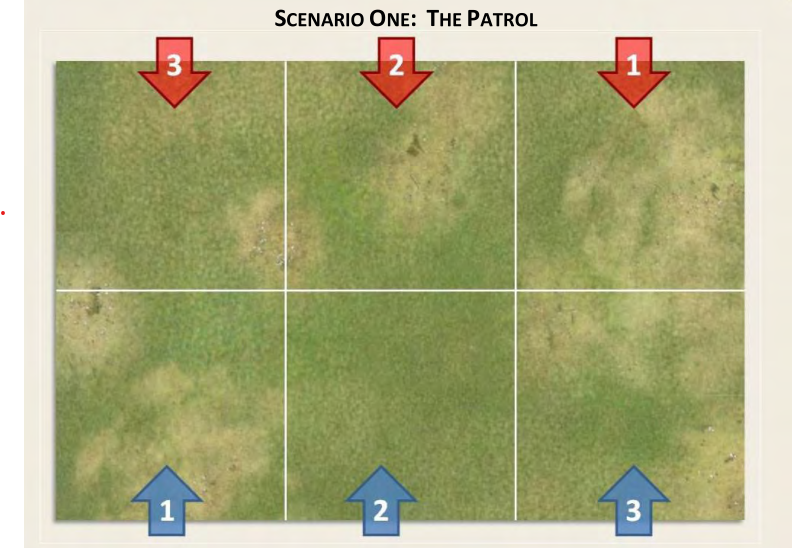
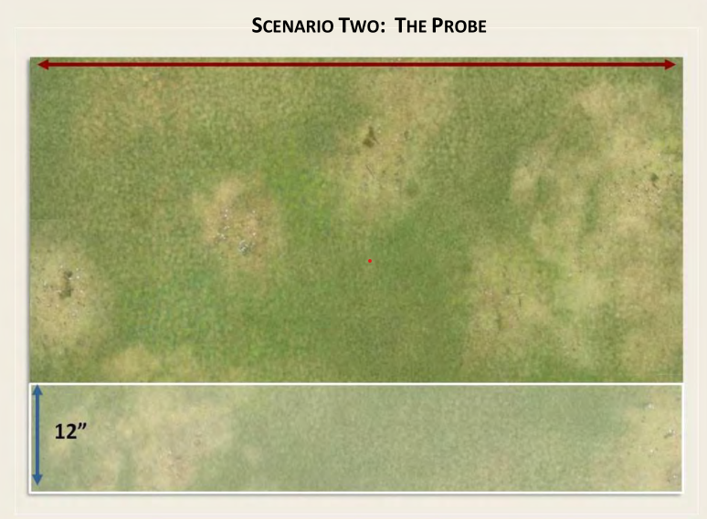
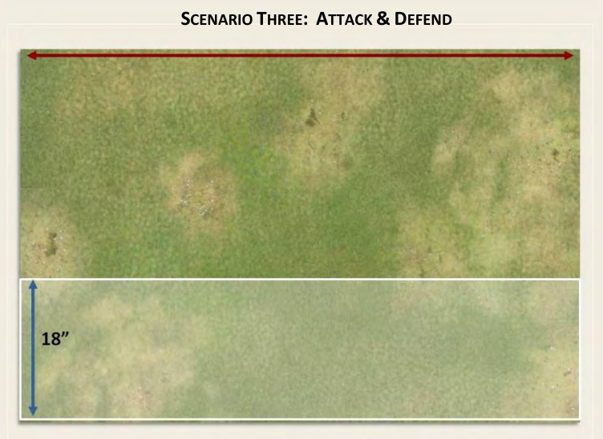
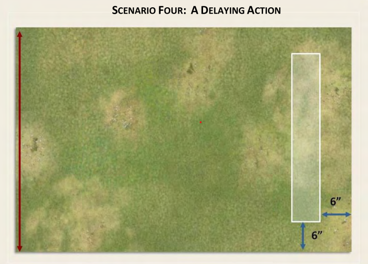
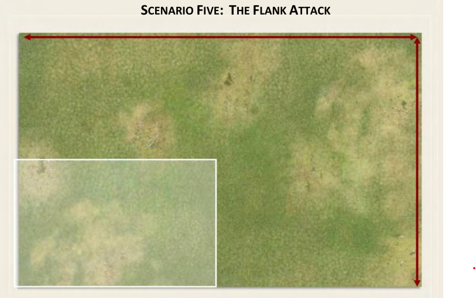
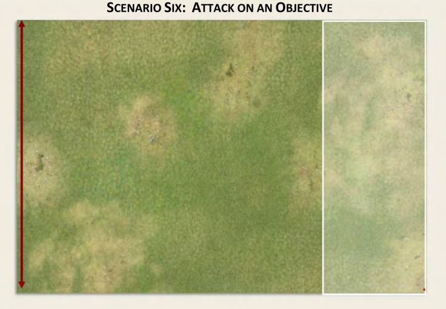

# Chainsword of Command
## Note on Turns
Chainsword of Command uses a unique turn sequence
to reflect a battle going through multiple Phases
of play. Each Phase of play represents just a few
seconds of action. As a result, Turns are of
variable length and the end of a Turn represents
a noticeable lull or break in the action

Multiple Phases make up a turn, where players alternate phases. Starting with a roll of the Command Dice, the active player makes his actions based on that roll, then hands the phase over to the other player. This alternation may continue many times before a single Turn ends.

## Glossary

**Unit**: Any group of models

**Fireteam / Team**: One or more models within mutual coherency distance that activate as a group

**Squad / Section**: Force organizational group of units that can be split into Teams

**Order**: Special action performed by officers to activate nearby Teams

**Command Die/Dice**: Dice (typically rolled in a pool) to determine that Phase's actions

**Phase**: The most continuous block of player actions. Multiple successive phases make up a Turn

**Force Morale**: The morale of an army as a whole

**Shock**: Value representing the morale decline of a Unit

## Patrol phase

During the Patrol Phase both sides use a number of circular Patrol Markers 2.5” in diameter. Unless otherwise noted, a warband’s force morale is determined by a d3 + the rounded down average leadership of all Troop units.

The player with the highest Force Morale Level starts – roll a D6 each in the case of a tie, with the higher roller moving first. The player moves one of his Patrol Markers up to 12” (ignoring terrain), while ensuring that it remains within 12” of at least one other
friendly Patrol Marker.

Once the first marker is moved, his opponent moves one of his Patrol Markers in the same manner. This then continues with the players taking turns to each move a marker.
When a marker reaches a point 12” from one or more enemy Patrol Markers, it will immediately cease movement even if it has not moved the full 12” available to it.

This Marker and the enemy’s Marker (or Markers if more than one is affected) are now locked in position and may make no further movement in any direction.

The players continue moving their other Patrol Markers until one or both sides have all of their markers locked in position.

To place a Jump-Off Point, select a point that is 6" away from the nearest friendly Patrol Marker, closer to that marker than the nearest two enemy Patrol Markers, and within cover from the closest two enemy Patrol Markers.

Once the first Jump‐Off Point is placed, the opposing player repeats the process with both players alternating until they both have all of their Jump‐Off Points placed on the table. The
number of Jump‐Off Points may vary depending on the scenario. Remove the Patrol Markers and begin the game.

## Deployment:
All units deploying together need to have the correct activation dice available
  Example:
    - Chosen Squad deploying with a Chaos Lord in a Land Raider. The Chosen Squad can deploy in the Land Raider (as per deploying with transport rule). If the command/ activation dice include a ‘4’, the Chaos Lord (Senior leader) can be selected to deploy with the Chosen, in the vehicle (as long as there is space available)

Reserves are handled as base system. Normal JOP deployment does not count for the purposes of reserves/interceptor.

The following USRs are modified for the purposes of deployment:
  Scout: Deploy 12" from JOP, may not pass enemy troops
  Infiltrate: Deploy 12" from Patrol Marker (BEFORE JOPs are placed) or 12" from JOP
  Deep Strike: TBD, affected by interceptor
  Outflank: as normal, affected by interceptor

## Command Dice:
At the start of each Player Phase, the active player rolls 5 Command Dice. Note: multiple rolls of 6 must combine to the largest result on the following table:
  1: Deploy or activate Team
  2: Deploy or activate Squad
  3: Deploy (with unit) or activate Junior leader
  4: Deploy (with unit) or activate Senior leader
  5: +1CP/Command point to be spent on stratagems (below)
  6x1: Wildcard (any above)
    6x2: Take next phase
    6x3: Game turn ends, take next phase
    6x3: Game turn ends, random event, take next phase

## Stratagems:
| CP| Effect
|---|-------------------------------------------
| 6 | Reroll single die (Max 1 per phase)
| 6 | Interrupt with unpinned Squad to fire or move
| 6 | End Game Turn
| 6 | Ambush with single Infantry Team
| 6 | Avoid taking Force Morale test
| 6 | ~~Relocate Sniper~~
| 6 | ~~Keep off-map barrage firing on Game Turn end //TODO: barrage unit rework: similar to flyers)~~

## Activations:
A unit may activate up to once per phase, it may move and fire in any order as outlined below:
### Movement:

Unit movement makes use of a combination of a model's Movement (M) and Initiative (I) characteristics depending on the mode.

| Type     | Effect
|----------|-------------------------------------------
| Standard | Move M"
| Charge   | Move M+2d6"
| Run      | Move M"+I"
| Tactical | Move I".  May not shoot this Phase.  5+ or +1 to Cover Save

  - Charge: M+2d6"
  - Normal: M"
  - Run: M"+I"
  - Tactical: I"
    - 5+ or +1 Cover Save
    - may not shoot this phase

### Fire:
  - Shoot (as per 40k)
  - Covering Fire: Snap shots at a target unit, that unit receives -1BS in the next Phase
  - Overwatch: a unit placed on Overwatch may shoot at any point during opponents Phase

### Officers:

| Rank    | Orders | Range | Roll
| --------|--------|-------|------
| Char    |   2    |   6   |  3
| IC      |   3    |   9   |  4
| Warlord |   4    |  12   |  4

When an Officer activates, he may spend an order on a unit:
| CP| Effect
|---|-------------------------------------------
1: Activate Unit (may move with unit)
1: Place Unit that has not Activated on Overwatch
1: Create and Activate new Fireteam with any number of models from attached unit
1: Transfer 1 model to existing Fireteam
1: Remove 1 shock from unit in Command Range

## Force Morale:
Starting: Average Unit Ld (Rounded up)

| FM | Effects (cumulative):
|----|--------------------------
| 4 | -1 Command Dice
| 2 | Remove JOP
| 3 | -1 Command Dice
| 1 | -1 Command Dice
| 0 | Rout/Surrender

## Shock:
Applied any time one or more armor saves are taken as a result of shooting. the following effects apply:
Movement: -1" per point
Shooting: -1 die from shooting pool (attacker's choice)
Morale: -1 Ld per point. Units are automatically pinned when Shock >=Ld
Broken: Shock>=2xLd

## Flyers:
Zooming flyers do not loiter over the battlefield. They zoom over the battlefield, fire at their targets and then continue on their
way. The only flyers that can loiter are those who go into hover mode.
Flying Vehicles will normally have a Junior Leader and will activate on a 3. Flying Monstrous Creatures may differ.

### Zooming flyers (once activated):
  - Flyers are never guaranteed to arrive on time. Once activated roll a d6, they arrive on a 4+
  - Pick a table edge and an entry point on that edge,
  - Pick an exit point on another table edge,
  - A line drawn between both points will be the attack vector.
  - Place the flyer at its entry point. Your opponent can then declare whether any units on Overwatch will shoot at the flyer, choosing a point anywhere on the plane’s attack run. Overwatch shooting must be declared when the plane is activated, but before any movement is made.
  - A zooming flyer can fire any weapons normally allowed at any point along that vector (multiple points can also be
chosen in order to hit multiple targets)

### Anti-Aircraft and Jink:
  - Only units on Overwatch or with Interceptor may fire at a Zooming Flyer
  - AA can be fired at Zooming Flyers at any point on the attack run.
  - AA fired by a unit with skyfire rolls to hit as normal. Units without Skyfire only hit on a 6+ (snap shots)
  - A flyer may opt to jink upon declaration of Overwatch shooting being used against it. If so the flyer receives a 4+
cover save and all shots it fires on that attack run only hit on a 6.

### Hovering:
Flyers which have a hover mode may:
  - elect to arrive via hover mode from their own board edge
  - If a Flyer is Hovering, it is treated exactly as a Fast Skimmer. This makes it more manoeuvrable, but often limits the
number of weapons it can fire.
  - A flyer may leave the table at any time. This is treated as returning to Zoom mode. The flyer moves in a straight line
forward off the table and may not embark models or fire any weapons on the Phase it leaves.

### Intercepting Attack Runs:
Flyers can be placed on 'Overwatch'. This represents senior leaders requesting the flyer to be used for intercept duties
To do this the flyer is activated as normal then a roll for deployment is made (on a 4+). If successful a table edge is selected,
this is where the intercept run is made from. The flyer is placed on Overwatch but kept off the table.
  - When an enemy plane arrives for an attack run (not an intercept run, you cannot intercept an intercepting flyer), the
flyer on Overwatch makes an intercept run from the edge previously selected.
  - An intercept run is made with the enemy plane the target.
  - The enemy plane can decide to either:
    - continue the attack run (fire at ground units and elect to jink if desired). In this case the intercepting flyer and any AA attack first, then the attack run is made.
    - opt to dogfight to intercepting flyer. This means the attack run is aborted and an attack is made at the intercepting flyer. In this case the intercepting flyer and any AA attack first, then the attack run is made.
    - Both flyers will be attacking frontal armour. A plane placed on overwatch loses Overwatch if it does something that activate, the Turn ends, or something else happens to
take the flyer off Overwatch

### Special Skills:
Vector Dancer - the zooming flyer may make one turn on its attack run, of no more than 90°. It must declare this turn (and the
point where it will turn) when nominating the entry and exit point from the table. When dogfighting a flyer with vector
dancer may always choose to attack the side armour of an enemy plane.

### Scenarios:
//TODO: Remake images

#### Scenario 1: The Patrol

##### Introduction
This game is the classic encounter in No‐Man’s‐
Land: your mission is to deny your opponent this
critical ground between the main lines of
defence.
##### The Patrol Phase
Each player selects a long table edge for their deployment and divides it into three even segments (24").
Each player rolls a d3 and uses the center of the corresponding segment as the entry point for the Patrol Phase.
Each player chooses whether to start the game with three or four Patrol Markers.
At the end of the Patrol Phase both players  place three Jump‐Off Points on the table.
##### Force Support
Each player receives d3*50 points of support.
Neither side may select entrenchments, static defences or a preliminary barrage as their choices.
##### Objective
To win a victory, one side must force his opponent to withdraw from the table (either voluntarily or due to a reduction in his Force Morale) whilst keeping his own Force Morale at 3 or greater.
If neither side achieves this, both armies withdraw, neither gaining control of No‐Man’s‐Land and the result being a dishonourable draw.
The side with the higher Force Morale will be the active player in the first Phase of the game.

#### Scenario 2: The Probe

##### Introduction
This game represents the cut and thrust of close combat in No‐Man’s‐Land ‐ one side advancing in an attempt to identify and find a route through the enemy’s outposts and push on towards their main line of resistance.
Maybe on the slopes of Monte Cassino or approaching the Deputy Commissioner’s Bungalow at Kohima.
##### The Patrol Phase
The defender deploys four Patrol Markers within 12” of his own table edge and within 12” of at least one other friendly Patrol Marker.
The attacker enters at a single entry point of his choosing on his own table edge.
At the start of the Patrol phase, the attacker makes d3+1 moves with his Patrol Markers.
At the end of the Patrol Phase, both players place three Jump‐Off Points.
##### Force Support
The attacker receives d6*50 additional points of support, with the defender receiving half of that value.
The attacker may not select entrenchments, static defences or a preliminary barrage as his choices.
The defender may not select a preliminary barrage among his choices.
##### Objective
The attacker’s objective is to move one Team to the enemy base line.
If this is achieved then the game ends as a victory for the attacker, any other result is a victory for the defender.
The side with the higher Force Morale will be the active player in the first Phase of the game.

#### Scenario 3: Attack and Defend

##### Introduction
This is a major advance against a known enemy position in their main line of defence, with a view to driving off the enemy.
This could be the final assault on Hill 112 or an attack on the Mareth Line in Tunisia or the drive into Bastogne.
##### The Patrol Phase
The defender deploys four Patrol Markers within 18” of his own table edge and within 12” of at least one other friendly Patrol Marker.
The attacker enters on a broad front anywhere on their table edge, as indicated by the red arrow on the map, with four Patrol Markers.
The attacker rolls 1D6 before the Patrol Phase begins.
The number rolled is the number of moves which the attacker immediately takes with his Patrol Markers.
At the end of the Patrol Phase both players will place three Jump‐Off Points on the table.
##### Force Support
The attacker receives 2d6*50pts, up to 500.
The defender takes support from the List with half of that value, rounding down any odd number.
The attacker has no restrictions on his support choices.
The defender may not select a preliminary barrage among his choices.
##### Objective
To win a victory, one side must force his opponent to withdraw from the table, (either voluntarily or due to a reduction in his Force
Morale) whilst keeping his own Force Morale at 3 or greater.
If neither side achieves this both will withdraw, with  neither gaining control of No‐man’s‐land and the result being a dishonourable draw.
The side with the higher Force Morale will be the active player in the first Phase of the game.

#### Scenario 4: Delaying Action

##### Introduction
In this scenario, a somewhat disordered defender is attempting to blunt the advance of a stronger attacker.
Barbarossa 1941 and a desperate Soviet force holding off the German invader, or a US force holding a vital road in the Ardennes.
This scenario must be played across the table lengthways, as shown.
##### The Patrol Phase
The defender starts with three Patrol Markers placed within the shaded area which is 6” by 36” in dimensions and located 6” from his friendly table edge.
These Patrol Markers must be a minimum of 6” apart, but may be placed by the defender as he wishes before the Patrol Phase begins.
The attacker enters the table with four Patrol Markers at any single point the player wishes on his table edge, as indicated by the red arrow.
The Patrol Phase begins then.
Once the Patrol Phase ends with one side locked down, the Jump‐Off Points are deployed; the defender player placing two, the attacker three.
The defender will then place a third Jump‐Off Point anywhere in the shaded area.
##### Force Support
The attacker receives 2d6*50pts, up to 500.
The defender takes support from the List with half of that value, rounding down any odd number.
The attacker has no restrictions on his support choices.
The defender may not select entrenchments, static defences or a preliminary barrage among his choices
##### Objective
To win a victory the attacker must capture one Jump‐Off Point in the grey area and hold it until the end of the Turn. Any other result is a victory for the defender.
The attacker will be the active player in the first Phase of the game.

#### Scenario 5: The Flank Attack

##### Introduction
This is where one side, having out‐manoeuvred his enemy, is making a flank attack against an important enemy position.
##### The Patrol Phase
The defender’s deployment is limited to one quarter of the table, a 36” by 24” area shown by the shaded area above.
The defender places three Patrol Markers within that area, all within 12” of at least one other friendly Patrol Marker.
The attacker places two separate groups of three Patrol Markers along the two edges indicated by
the red arrows, all within 12” of at least one other friendly Patrol Marker in their group.
These groups move separately of each other, and
do not need to be within 12” of any Markers in
the other group.
The attacker makes d3+1 moves during the patrol phase.
These may be from either group as the player
wishes, but not both groups each time.
Once the Patrol Phase of the game ends, the
attacker may place four Jump‐Off Points on the
table, selecting any Patrol Markers of the six
present to place these as normal.
The defender places his three Jump‐Off Points on
the table and may then add a further fourth
Jump‐Off Point anywhere within his original
quarter of the table.
##### Force Support
The attacker receives 2d6*50 points of support, with the defender receiving half that roll (rounding down) times 50.
There are no restrictions on support choices for either side.
##### Objective
To win a victory, the attacker must force the
defender to withdraw from the table, either
voluntarily or due to a reduction in his Force
Morale, but keeping his own Force Morale at 3 or
more. If he fails, the defender will win.
The attacker will be the active player in the first
Phase of the game.

#### Scenario 6: Attack on an Objective

##### Introduction
This scenario is ideal for recreating a classic
assault on a defended objective, such as Pegasus
Bridge, Pavlov’s House in Stalingrad or a
Command Raid on a cliff‐top radio station.
Anywhere that one player is attacking a major
objective held by his opponent.
##### The Patrol Phase
The table should have a clear objective in the
final quarter furthest from the attacker,
somewhere in the shaded area. This should be
something of significance, such as a village, a
crossroads or similar.
The attacker deploys either three or four of his
Patrol Markers on his friendly edge, all within 12”
of at least one other friendly Patrol Marker. The
defender deploys four Patrol Markers on the
game objective.
The attacker immediately makes d3+1 moves at the start of the Patrol Phase.
At the end of the Patrol Phase the attacker will
place three Jump‐Off Points. The defender places
three Jump‐Off Points on the table and may then
add a further fourth Jump‐Off Point on the
objective itself.
##### Force Support
The attacker receives 2d6*50 points of support, with the defender receiving half that roll (rounding down) times 50.
There are no restrictions on support choices for either side.
##### Objective
To win a victory, the attacker must capture the
game objective and hold it until his opponent is
obliged to withdraw from the table, either
voluntarily or due to Force Morale. Any other
result is a victory for the defender.
The attacker will be the active player in the first
Phase of the game.
